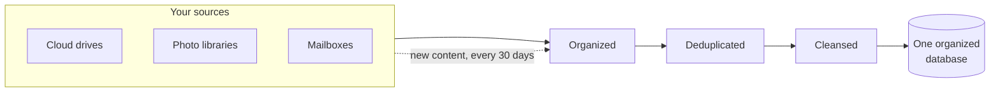

# stash2flow

> **One clean, organized and curated copy of your digital life: only what matters, and nothing else.**

A self-hosted, open-source app that reads your documents, photos and e-mail
wherever they are scattered, organizes them, and helps you end up with one
copy of what matters. You decide what matters. The app only proposes.

**Status: planning.** No code yet. The plan is in
[docs/doing/PLAN-FEATURE-001-media-index.md](docs/doing/PLAN-FEATURE-001-media-index.md).

## The problem: digital trash

Most of us keep the same files in several clouds, photos in three resolutions,
scans with names like `scan0042.pdf`, and a mailbox that is mostly
advertisement. We keep it because storage is cheap and sorting is not.

### How big is it? Honestly: nobody knows

There is no reliable measurement of how much stored data is garbage. What
exists are estimates, and they should be read as such:

- **Companies.** A 2016 survey by Veritas, the *Global Databerg Report*, found
  that organizations consider about 15% of their stored data business-critical
  and about 33% redundant, obsolete or trivial. The remaining 52% is "dark":
  nobody knows what it is or what it is worth. This is what 2,500 IT managers
  believed, not something that was measured, and it comes from a company that
  sells data management.
- **Copies.** In 2020 the analyst firm IDC estimated that for every unit of
  unique data in the world, about nine are replicated.
- **Private people.** We know of no credible figure for personal clouds and
  mailboxes at all.

So the largest share is not known garbage. It is data nobody has looked at.
That is the first thing this app addresses: you cannot curate what you cannot
see.

### What we do know: it compounds

The same IDC forecast put the growth of data created each year at about 26%
compound, which means the amount roughly doubles every three years. Whatever
share of it is trash, it grows at that rate too. Every year the pile gets
harder to sort, so the cost of not sorting is not constant. It compounds.

### Your own number

The one figure that can be measured is yours. The app measures your digital
life before and after: when it first reads your sources it records how many
files and how many bytes you have, in how many places, and what share is
duplicates and mail you never wanted. After you have organized and cleaned up,
it shows the same figures again. Those numbers are yours alone; they never
leave your network.

The first measured case will be the author's own: his baseline and what is
left afterwards, published here by him once there is something to show.

## How it gets you there

Many sources go in, one organized database comes out. It is constantly
updated, and it never grows fat: whatever arrives later goes through the same
path before it is kept.

1. **Index.** Read every source, keep a copy on your own server, make
   everything searchable by its text, and group duplicates.
2. **Organize.** A frontend where everything is arranged by a taxonomy you
   shape, with a search over all content.
3. **Clean copy.** Write the organized content to one place you choose.
4. **Clean up.** Remove what is unnecessary from where it came from.

## Principles

- **Nothing is deleted without your go.** A file is removed from a source only
  when verified copies exist elsewhere.
- **Private by construction.** No document text or image leaves your network.
  All models run locally.
- **Yours to run.** Self-hosted. Sources, accounts and models are
  configuration, so it fits other infrastructure and other sources than ours.
- **Open source**, under the MIT licence.

## Sources for the figures above

- Veritas, *Global Databerg Report*, press release of 15 March 2016:
  <https://www.veritas.com/news-releases/2016-03-15-veritas-global-databerg-report-finds-85-percent-of-stored-data>
- IDC, *Global DataSphere Forecast*, press release of 8 May 2020:
  <https://www.businesswire.com/news/home/20200508005025/en>

---

Built with the struct2flow blueprint, which provides the agent protocol, the
quality gates and the documents under `docs/`.
